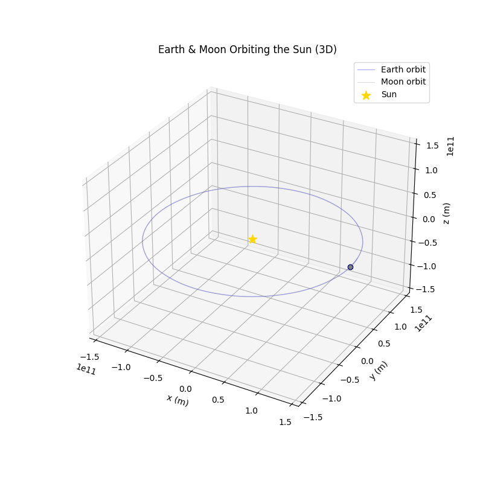

# 🚀 **Sun--Earth--Moon Orbital Dynamics Simulator**

### *High-precision 3-body gravitational simulation using the Runge--Kutta 4 integrator*

This project models the **three-body gravitational system** of the Sun,
Earth, and Moon using Newtonian mechanics and a custom-built **RK4
(Runge--Kutta 4)** integrator written in **C++17**. The output is
visualized in **Python** using interactive 3D plots and animations.

------------------------------------------------------------------------

## 🌌 Features

### 🛰️ **Physics Simulation (C++)**

-   Full **3-body gravitational interaction**
-   Classical **Newtonian gravity**
-   **3D vector dynamics** (x, y, z)
-   **Runge--Kutta 4 (RK4)** numerical integrator
-   Correct **barycentric motion** of the Sun
-   Accurate **Earth orbital motion**
-   Moon orbit with **5.145° inclination**
-   One-year simulation; **hourly time step**

### 📊 **Visualization (Python)**

-   3D Sun--Earth--Moon trajectories
-   Earth-centered Moon orbit view
-   Optional **exaggerated Moon orbit** for clarity
-   Export animations to **.mp4** or **.gif**
-   Fully interactive camera controls

------------------------------------------------------------------------

## 📁 Project Structure

    earth-and-moon-orbits/
    ├── include/
    │   ├── body.h
    │   ├── main.h
    │   ├── simulation.h
    │   ├── utils.h
    ├── src/
    │   ├── main.cpp
    │   ├── simulation.cpp
    │   └── utils.cpp
    ├── 3Dplot.py
    ├── 3D_exaggerated_plot.py
    ├── orbit_three_body.csv
    ├── requirements.txt
    └── CMakeLists.txt

------------------------------------------------------------------------

## ⚙️ Building the Simulation

### **Requirements**

-   CMake ≥ 3.14
-   C++17 compiler (GCC / Clang / MSVC)

### **Build & Run (Linux/macOS)**

``` bash
mkdir build && cd build
cmake ..
make
./bin/earth_and_moon_orbits
```

This generates:

    orbit_three_body.csv

------------------------------------------------------------------------

## 📊 Visualization (Python)

Install dependencies:

``` bash
pip install -r requirements.txt
```

Run standard plot:

``` bash
python 3Dplot.py
```

Run exaggerated Moon orbit:

``` bash
python 3D_exaggerated_plot.py
```

------------------------------------------------------------------------

## 🎥 Saving Animations

``` python
import shutil

if shutil.which("ffmpeg"):
    ani.save("earth_moon_orbits.mp4", writer="ffmpeg", fps=30)
elif shutil.which("magick"):
    ani.save("earth_moon_orbits.gif", writer="imagemagick", fps=30)
```

------------------------------------------------------------------------

## 🧠 Physics Model

### Integrator

Runge--Kutta 4 (RK4), fixed timestep

### Timestep

Δt = 3600 seconds (1 hour)

### Bodies

| Body  | Mass (kg)     | Notes                         |
|-------|---------------|-------------------------------|
| Sun   | 1.9891×10³⁰   | Free-moving; barycentric wobble |
| Earth | 5.972×10²⁴    | 1 AU; ~30 km/s                |
| Moon  | 7.3477×10²²   | 384,400 km; 5.145° inclination |

------------------------------------------------------------------------

## 🖼 Visualizations

### Actual Orbits



### Exaggerated Moon Orbit


------------------------------------------------------------------------

## 👨‍💻 Author

**Sinan Demir**\
Computer Science student exploring numerical physics and scientific
visualization.

------------------------------------------------------------------------

## 🛰️ License

MIT License (LICENSE)
